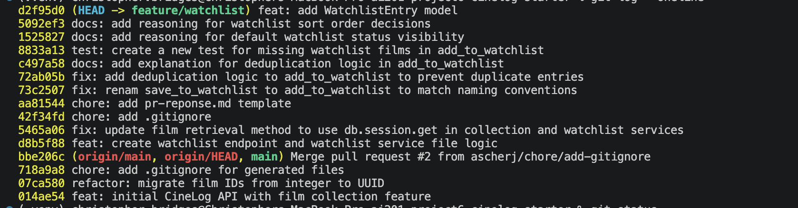

# PR Response Doc — CineLog Watchlist Feature

## AI Usage
I used AI in a few specific ways during this project:

- **Comment 4 and 5 (design decisions):** After writing my own responses, I asked AI what counterarguments a reviewer might raise. For Comment 4 it raised the privacy-by-default argument (that defaulting to public exposes user data and the safer default is private). For Comment 5 it raised that the collection already sorts by date added, so a reviewer might want the watchlist to match for consistency. I considered both but kept my original positions — public default because a watchlist isn't sensitive on CineLog, and alphabetical because finding a specific film matters more than seeing recent additions.
- **Rebase (Comment 6):** I used AI to figure out why the WatchlistEntry model disappeared after the rebase (the merge silently dropped it because main deleted it and my branch never modified that file), and to help re-add it with the UUID film_id.
- **Commit history:** I used AI to check that my commit messages followed conventional commit format.

## Comment 1 — Rename
**What I did:** Change the named of the function to add_to_watchlist to be consistent with the existing naming convention
**How I verified:** I used the VScode find and replace feature. I then ran the test suite to make sure everything passes.

## Comment 2 — Deduplication
**What I did:** I added a small block of code mirroring the collection service that checks for an existing id. If found, it raises an exception. 
**How I verified:** I used Postman to send duplicate video submissions and test the api.

## Comment 3 — Missing test
**What I did:** I created a new file and copied over the template code from test_collection.py. I think updated the function names to test the new watchlist functions. 
**How I verified:** I ran the test suite to see that everything is passing correctly.

## Comment 4 — Default visibility
**My position:** We will keep the default status to True for the watchlist.
**Reasoning:** Watchlists are usually not sensistive user information. In my opinion it would cause any issues to have to default to a public view. I think the majority of users will want their watchlist visible, so without a way to change that settings, I think its best to err on the side of pleasing the most people. 
**Tradeoff acknowledged:** Some people may hoenstly not want their watchlist visible, but I think that will be a minority. A feature can be added to toggle that in the future.

## Comment 5 — Sort order
**My position:** The sort order should be kept alphabetical and not by date added.
**Reasoning:** Usually people don't care when something was added to their watchlist. They aren't planning an order; they just added something they were interested in. They would care more about being able to find what they want to watch on their watchlist.
**Engagement with reviewer's point:** I understand that some people may want to find a movie they just added, but it seems rare that someone would care about that. It's more common for someone to be looking for something in particular and search by name, making alphabetical the better choice.

## Comment 6 — Rebase
**What conflicted:** The .gitignore conflicted since both main and my branch had added one. The main refactor also deleted the WatchlistEntry model when it migrated film IDs to UUIDs, and because my branch never touched models.py the rebase silently dropped it.
**How I resolved it:** I merged the two .gitignore files into one and continued the rebase. Then I added WatchlistEntry back into models.py and changed film_id from db.Integer to db.String(36) to match the new UUID Film.id, like CollectionEntry does.
**How I verified no conflict remains:** I ran git status to confirm a clean tree, ran the full test suite with pytest and everything passed.

## PR Description

**What the feature does:** This PR adds a watchlist to CineLog so a user can save films they want to watch later. A film is added to a user's watchlist through the add endpoint, and the service checks for duplicates so the same film can't be added to a user's watchlist twice.

**Design decisions:**
- Default visibility: watchlist entries default to public (public=True). A watchlist isn't sensitive info and most users will want theirs visible, so I defaulted to public. A toggle to make it private can be added later.
- Sort order: the watchlist is sorted alphabetically by title instead of by date added. People usually aren't tracking when they added something, they just want to find a specific film, so alphabetical is easier to scan.

**How to test it manually:**
1. Start the app with `python app.py` (runs at http://127.0.0.1:5000).
2. Send a POST to `/watchlist/<user_id>/add` with a JSON body like `{"film_id": "<film_uuid>"}` using curl or Postman, using a real user_id and film_id from the database. You should get back a 201 with the new watchlist entry.
3. Send the same request again. The deduplication check prevents a duplicate entry from being created.
4. Run the test suite with `pytest tests/ -v` to confirm the watchlist tests pass.

## Commit History
